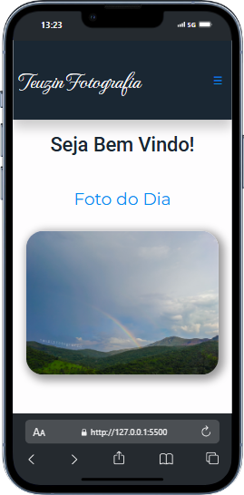

# 📸 Teuzin Fotografia

Bem-vindo ao **Teuzin Fotografia**! Este projeto é uma vitrine onde posso compartilhar minhas fotos online e, ao mesmo tempo, demonstrar minhas habilidades em HTML, CSS e JavaScript. Durante o desenvolvimento, tive a oportunidade de aprender e aplicar novos métodos e técnicas nessas tecnologias.

🌐 **Visite o site:** [teuzinfotografia.vercel.app](https://teuzinfotografia.vercel.app)

## 📷 Projeto

**Mobile**

##

**Desktop**

## 🚀 Tecnologias

- **HTML5**: Estrutura do site.
- **CSS3**: Estilização e layout com foco em design moderno.
- **JavaScript**: Interatividade e funcionalidades dinâmicas.

## ✨ Funcionalidades

- Galeria de fotos responsiva.
- Navegação intuitiva e fácil.
- Layout moderno e clean.

## 📬 Contato

Se você gostou do projeto ou tem alguma sugestão, entre em contato comigo em: mateuszitosilva@gmail.com

---

**Teuzin Fotografia** © 2024. Todos os direitos reservados.
